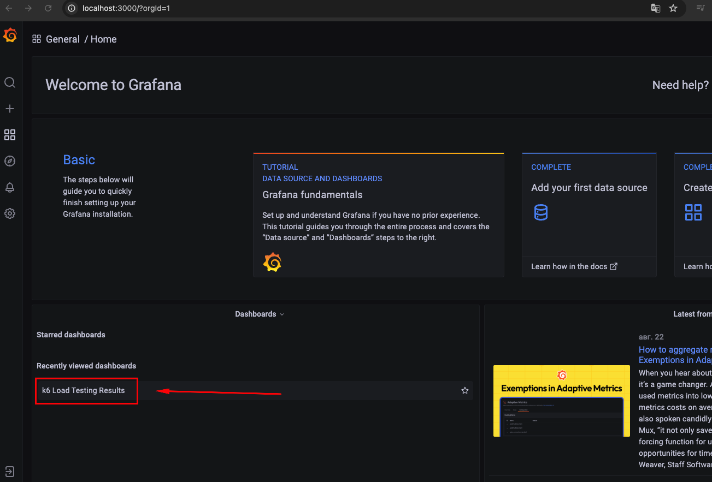
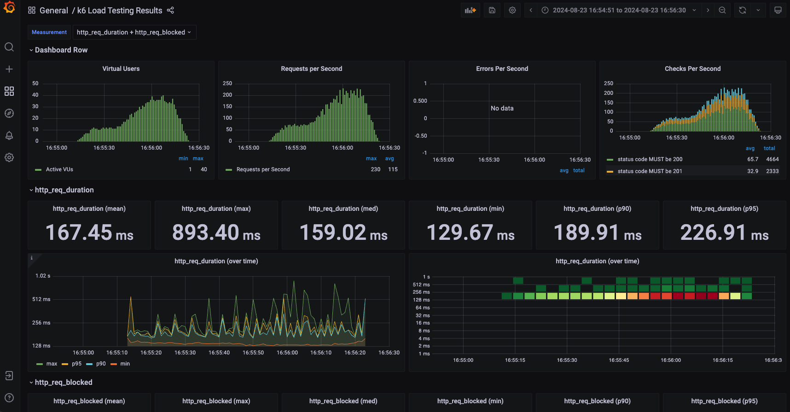

# k6-influxdb-grafana

This repository contains everything you need to visualize and analyze the results of K6 testing.

## Сontent
- [Technology](#Technology)
- [Requirements](#Requirements)
- [Build](#Build)
- [Execution](#Execution)
- [Report](#Report)
- [License](#License)

## Technology
- [k6](https://k6.io/)
- [InfluxDB](https://www.influxdata.com/products/influxdb/)
- [Grafana](https://grafana.com/)
- [Docker](https://www.docker.com/)

## Requirements
To run the project, you need [Docker](https://www.docker.com/).

## Build

1. Save your k6 script to the `scripts` project folder

2. Build and run the service containers using the command:
```sh
docker-compose up -d
```

## Execution

1. Execute the command to run your script by specifying:
```sh
docker-compose run k6 run /scripts/performance-test.js
```
- `/scripts/performance-test.js` => k6 script file in the `scripts` folder

3. Open Grafana Url:
```sh
http://localhost:3000/
```

## Report

4. Open Grafana dashboard:




## License
This project is licensed under the MIT License - see the [LICENSE](LICENSE) file for details